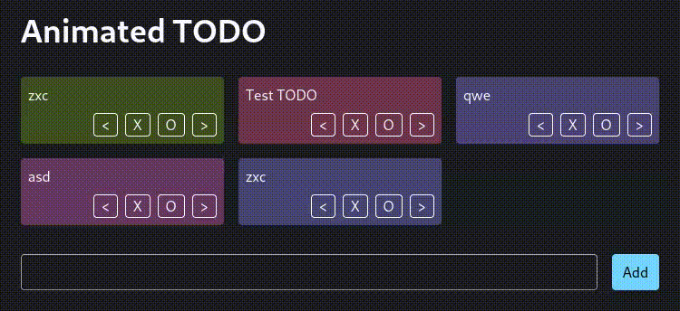

# React Simple FLIP

[](https://www.npmjs.com/package/react-simple-flip)
[](https://bundlephobia.com/package/react-simple-flip)
[](https://www.jsdocs.io/package/react-simple-flip)
[](https://stackblitz.com/github/phaux/react-simple-flip?file=app/TodoList.tsx)

A library for FLIP animations in React.



```jsx
import { useState } from "react"
import { FlipList } from "react-simple-flip"

export function App() {
  const [todos, setTodos] = useState([])

  return (
    <ul>
      <FlipList>
        {todos.map((todo, idx) => (
          <li key={idx}>{todo}</li>
        ))}
      </FlipList>
    </ul>
  )
}
```
